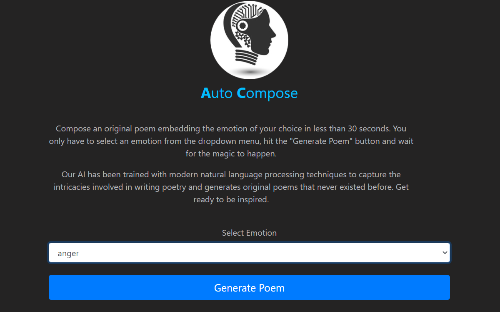

# AutoCompose



<h2 align="center"><a  href="http://autocompose.herokuapp.com/">Live Demo</a></h2>

# Table of Contents

- [AutoCompose](#autocompose)
- [Table of Contents](#table-of-contents)
- [Technologies Used](#technologies-used)
  - [GutenTag](#gutentag)
  - [EmoLex](#emolex)
  - [HuggingFace](#huggingface)
  - [Flask](#flask)
  - [Algorithmia](#algorithmia)
  - [Heroku](#heroku)
- [About the Project](#about-the-project)
  - [Idea](#idea)
  - [Data](#data)
  - [Models](#models)
  - [Deploying Working Demo](#deploying-working-demo)
- [Directory Structure](#directory-structure)

# Technologies Used

### GutenTag

GutenTag tool was used to build the required poetry corpus from the <a href="https://www.gutenberg.org/">Project Gutenberg</a> website which is a massive online database containing over 59000 eBooks.

### EmoLex

<a href="https://saifmohammad.com/WebPages/NRC-Emotion-Lexicon.htm">EmoLex</a> is a crowdsourced dataset of associations between words and emotions. It was used to classify the poetry corpus based on emotion of the poems. A language model was built for each emotion by using poems corresponding to that emotion.

### HuggingFace

HuggingFace is an AI community that provides various open source models in natural language processing. **OpenAI's GPT-2** model was used from HuggingFace's model hub which was fine-tuned on a large poetry corpus.

### Flask

Flask is a micro web framework written in Python. It was used to build a web app which is used to interact with the fine-tuned GPT-2 models.

### Algorithmia

Algorithmia is a MLOps tool that provides a simple and faster way to deploy your machine learning model into production. It was used to build a web API to interact with the model. Users can make API requests to the model through the flask app.

### Heroku

Heroku is a platform as a service (PaaS) that enables developers to build, run, and operate applications entirely in the cloud. It was used to deploy the web app so that it could be accessed by users from all over the world 24x7.

# About the Project

### Idea

This project was developed with the aim of creating a tool that can automatically compose original poetry within an instant embedding the required emotion. OpenAI's GPT-2 was chosen as the base language model because it's transformer architecture with masked self-attention heads has enabled it to perform exceptionally well with generation related tasks.<br>

### Data

The dataset was obtained from the <a href="https://www.gutenberg.org/">Project Gutenberg</a> website. The <a href="https://saifmohammad.com/WebPages/NRC-Emotion-Lexicon.htm">EmoLex</a> tool was used to segment the poetry corpus into 8 different emotion classes - `anger, anticipation, disgust, fear, joy, sadness, surprise and trust`. The poems which did not fit into any of these categories were added into the neutral category.<br>

### Models

Initially, the GPT-2 model was trained on the neutral poems. This gave us the 'neutral' model to generate any general poem. Models for each emotion were created by fine-tuning this 'neutral' model on poems of corresponding emotions. The entire process of creating these models can be found in this [notebook](./notebooks/AutoCompose.ipynb).
These models were uploaded to the Huggingface model hub.<br> Following are the links to the models of each emotion:

- [Anger](https://huggingface.co/prajwalcr/poetry-anger_gpt2)
- [Anticipation](https://huggingface.co/prajwalcr/poetry-anticipation_gpt2)
- [Disgust](https://huggingface.co/prajwalcr/poetry-disgust_gpt2)
- [Fear](https://huggingface.co/prajwalcr/poetry-fear_gpt2)
- [Neutral](https://huggingface.co/prajwalcr/poetry_gpt2)

### Deploying Working Demo

Algorithmia was used to build an API to interact with these models. A flask app was created to allow users to send API requests to Algorithmia and receive the generated poems. The app was deployed and made live using Heroku.

# Directory Structure

```
📦AutoCompose
┣ 📂data           --> Contains entire poetry corpus as well as poem collections of each emotion stored in json format
┣ 📂models         --> Contains language models fine-tuned for each emotion
┃ ┣ 📂anger
┃ ┣ 📂anger2
┃ ┣ 📂anticipation2
┃ ┣ 📂disgust2
┃ ┣ 📂fear
┃ ┣ 📂fear2
┃ ┣ 📂joy
┃ ┣ 📂joy2
┃ ┣ 📂neutral
┃ ┣ 📂sadness2
┃ ┣ 📂surprise2
┃ ┣ 📂trust2
┣ 📂notebooks      --> Contains .ipynb files used to work with dataset and train the model
┣ 📂outputs        --> Contains 25 poems generated by the model for each emotion
┣ 📂readme-assets  --> Contains images and gifs used in readme file
┣ 📂src            --> Contains flask app and other supporting python files
┃ ┣ 📂static
┃ ┃ ┗ 📂images
┃ ┣ 📂templates
```
